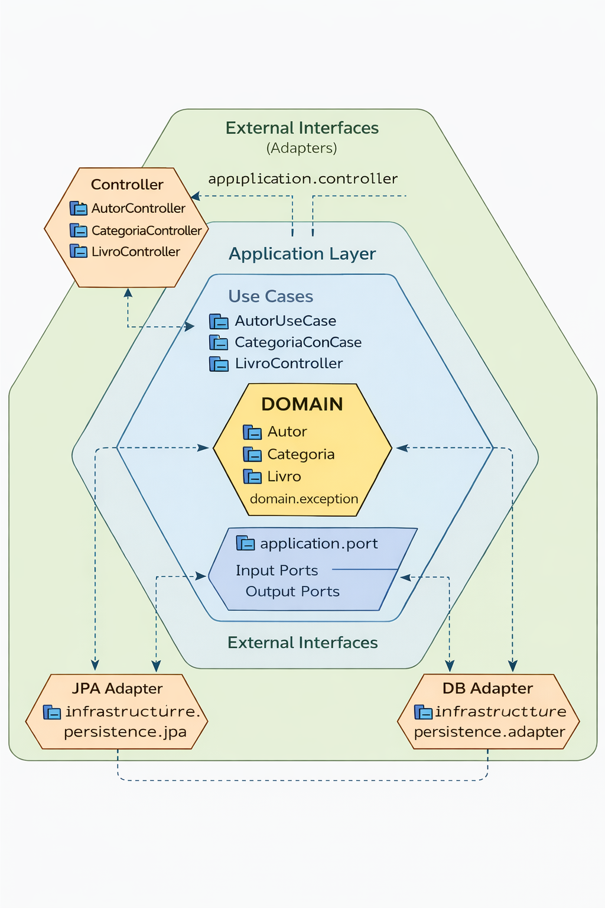

# Arquitetura do Projeto – Livro (Hexagonal / Ports & Adapters)

Este documento descreve a arquitetura adotada no projeto, suas camadas, responsabilidades e decisões de design, com foco na feature **Livro**.  
O objetivo é servir como **material de aprendizado**, **referência futura** e **guia de consistência arquitetural**.

---

## 1. Arquitetura Adotada

O projeto segue os princípios da **Arquitetura Hexagonal (Ports & Adapters)**, com separação clara entre:

- **Domínio**
- **Casos de Uso**
- **Portas (Interfaces)**
- **Adapters (Infraestrutura / JPA)**

A regra mais importante:

> **O domínio e os casos de uso NÃO conhecem frameworks, banco de dados ou JPA.**

---

## 2. Visão Geral das Camadas

```
┌─────────────────────────────────────────────┐
│              CAMADA EXTERNA                 │
│          (Adapters / Interfaces)            │
│                                             │
│  application.controller                     │
│   ├─ AutorController                        │
│   ├─ CategoriaController                    │
│   └─ LivroController                        │
│                                             │
│  infrastructure.persistence.adapter         │
│  infrastructure.persistence.jpa             │
│                                             │
└───────────────▲─────────────────────────────┘
                │
                │ (Ports)
                │
┌───────────────┴──────────────────────────────┐
│              CAMADA DE APLICAÇÃO             │
│               (Use Cases)                    │
│                                              │
│  application.useCase                         │
│   ├─ AutorUseCase                            │
│   ├─ CategoriaUseCase                        │
│   └─ LivroUseCase                            │
│                                              │
│  application.port                            │
│   ├─ Ports de entrada (input)                │
│   └─ Ports de saída (output)                 │
│                                              │
└───────────────▲──────────────────────────────┘
                │
                │
┌───────────────┴──────────────────────────────┐
│                CAMADA DE DOMÍNIO             │
│                 (Core)                       │
│                                              │
│  domain                                      │
│   ├─ Autor                                   │
│   ├─ Categoria                               │
│   ├─ Livro                                   │
│   └─ domain.exception                        │
│                                              │
│  (Regras de negócio puras, sem dependências) │
└──────────────────────────────────────────────┘

````
## 3.Desenho da Arquitetura


Dependências sempre apontam **para dentro**, nunca para fora.

### Nome das camadas (resumido)

1. **Domain (Core do sistema)**

    * Entidades
    * Regras de negócio
    * Exceções de domínio

2. **Application (Casos de Uso)**

    * Orquestra o fluxo
    * Define **Ports (interfaces)**
    * Não conhece framework nem infraestrutura

3. **Adapters / Infrastructure (Camada externa)**

    * Controllers (entrada – REST)
    * Persistência (JPA, adapters, entities)
    * Implementações dos ports
---

### Características importantes:

* O domínio **usa objetos**, não IDs soltos.
* `Livro` **possui `Autor` e `Categoria` como objetos**, pois isso representa a realidade do negócio.
* Não existe `Entity`, `@Column`, `@ManyToOne`, etc.

---

## 4. Camada de Use Case (Application)

### 4.1 Responsabilidade do Use Case

O **Use Case** é o **orquestrador da regra de negócio**.

Ele é responsável por:

* Validar regras
* Buscar dados necessários
* Criar o **objeto de domínio completo**
* Decidir **o que** será persistido (não **como**)

> ❌ O Use Case NÃO sabe o que é JPA
> ❌ O Use Case NÃO cria `Entity`
> ❌ O Use Case NÃO acessa banco diretamente

---


### Pontos-chave:

* O Use Case **busca Autor e Categoria apenas uma vez**
* O Use Case **monta o Livro completo**
* O Use Case **não conhece Entity nem JPA**

---

## 5. Ports (Interfaces)

As **Ports** são contratos que o Use Case usa para se comunicar com o mundo externo.

### 5.1 LivroRepositoryPort

```kotlin
interface LivroRepositoryPort {
    fun salvar(livro: Livro)
    fun existePorTitulo(titulo: String): Boolean
    fun existePorIsbn(isbn: String): Boolean
}
```

### Importante:

* O contrato trabalha **com objetos de domínio**
* Nenhuma referência a `Entity`

---

## 6. Adapters (Infraestrutura / JPA)

### 6.1 Responsabilidade do Adapter

O Adapter é responsável por:

* Converter **Domínio → Entity**
* Lidar com JPA, Hibernate, banco
* Resolver detalhes técnicos

> ✅ Aqui é permitido usar `Entity`, `JpaRepository`, `getReferenceById`

---

### 6.2 Conversão Domínio → Entity

### Por que buscar `AutorEntity` e `CategoriaEntity` aqui?

* Porque **Entity ≠ Domínio**
* O Use Case **não pode criar Entity**
* `getReferenceById` é detalhe de infraestrutura
* Evita múltiplas queries desnecessárias
* Mantém a arquitetura limpa

---

## 7. Por que NÃO buscar novamente no Use Case?

Pergunta comum levantada durante o desenvolvimento:

> “Se o Use Case já buscou Autor e Categoria, por que o Adapter busca de novo?”

### Resposta arquitetural:

* O Use Case busca **Domínio**
* O Adapter precisa de **Entity**
* São objetos diferentes, com responsabilidades diferentes

Buscar novamente:

* ❌ Não viola arquitetura
* ❌ Não duplica regra de negócio
* ✅ Mantém separação correta de camadas

---

## 8. O que NÃO fazer (Anti-patterns)

❌ Criar `LivroEntity` no Use Case
❌ Passar `AutorEntity` para o domínio
❌ Usar `JpaRepository` no Use Case
❌ Trocar `Categoria` por `categoriaId` no domínio
❌ Misturar regras de negócio com detalhes técnicos

---

## 9. Regra de Ouro

> **Use Case trabalha com Domínio.
> Adapter trabalha com Infraestrutura.
> Entity nunca vaza para dentro.**

---

## 10. Benefícios dessa Arquitetura

* Código mais testável
* Domínio independente de banco
* Facilidade para trocar JPA por outro mecanismo
* Clareza de responsabilidades
* Escalabilidade do projeto

---

## 11. Conclusão

Essa estrutura garante que:

* O **Use Case pense em negócio**
* O **Adapter pense em persistência**
* O **Domínio permaneça limpo e expressivo**